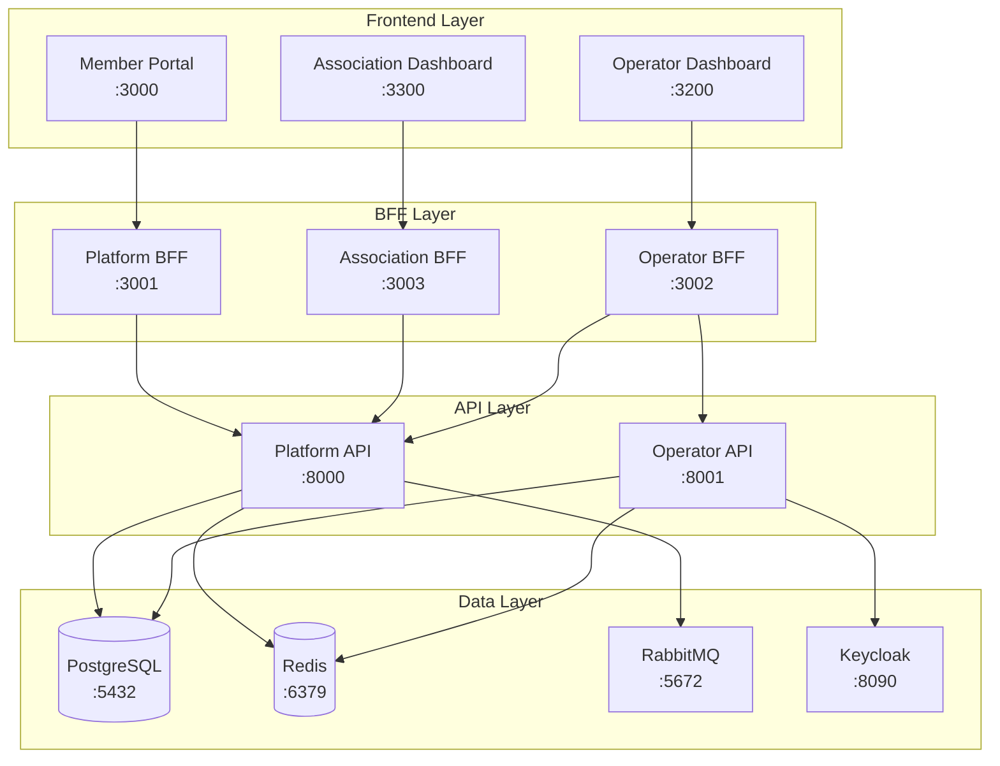

# 🚀 Association Platform - Architecture Multi-Repository Complète

## ✅ Migration Réussie !

L'architecture monolithique a été **successfully** transformée en une architecture multi-repository moderne et scalable ! 

## 📊 Résultats de la Validation

```
🎯 Validation Summary
===================
✅ Passed: 78/78 tests
⚠️  Warnings: 0
❌ Errors: 0

🎉 Multi-Repository structure validation PASSED! 🎉
```

## 🏗️ Architecture Finale

### 📁 Structure des Repositories

```
association-platform/
├── association-platform-infrastructure/     # Infrastructure & Services
│   ├── docker-compose.infrastructure.yml   # PostgreSQL, Redis, RabbitMQ, Keycloak, Traefik
│   ├── scripts/setup-dev.sh               # Script de configuration
│   ├── infrastructure/                    # Configurations Traefik, etc.
│   └── README.md                          # Documentation infrastructure
│
├── association-platform-backend-apis/      # APIs Backend Symfony
│   ├── platform-api/                     # API métier principale
│   ├── operator-api/                     # API administration SaaS
│   ├── shared/                           # Code partagé (entities, services)
│   │   ├── entities/Association.php      # Entité Association partagée
│   │   └── services/ApiResponseService.php
│   ├── docker-compose.apis.yml           # Configuration Docker APIs
│   └── README.md                          # Documentation APIs
│
├── association-platform-bff-services/      # Services BFF NestJS
│   ├── platform-bff/                     # BFF pour Member Portal
│   ├── operator-bff/                     # BFF pour Operator Dashboard
│   ├── association-bff/                  # BFF pour Association Dashboard
│   ├── shared/                           # Code partagé
│   │   ├── types/api-responses.ts         # Types TypeScript partagés
│   │   └── services/http-client.service.ts
│   ├── package.json                       # Configuration workspace
│   ├── docker-compose.bff.yml            # Configuration Docker BFF
│   └── README.md                          # Documentation BFF
│
├── association-platform-frontend-apps/     # Applications Frontend Next.js
│   ├── member-portal/                    # Interface membres publique
│   ├── operator-dashboard/               # Interface admin SaaS
│   ├── association-dashboard/            # Interface gestion associations
│   ├── shared/                           # Composants partagés
│   │   ├── components/Layout.tsx          # Layout partagé
│   │   └── hooks/useApi.ts               # Hook API partagé
│   ├── package.json                       # Configuration workspace
│   ├── docker-compose.frontend.yml       # Configuration Docker Frontend
│   └── README.md                          # Documentation Frontend
│
├── .env                                   # Configuration environnement principale
├── .env.template                         # Template sécurisé pour production
├── setup-all.sh                         # 🚀 Script de setup complet
├── start-all.sh                         # ▶️  Démarrer tous les services
├── stop-all.sh                          # ⏹️  Arrêter tous les services
├── health-check.sh                      # 🏥 Vérification santé services
├── sync-configs.sh                      # 🔄 Synchronisation configurations
├── validate-structure.sh               # ✅ Validation architecture
├── docker-compose.test.yml             # Configuration tests intégration
└── README.md                            # 📖 Documentation principale
```

## 🎯 Avantages de la Nouvelle Architecture

### 🔧 **Développement**
- ✅ **Développement parallèle** : Équipes indépendantes par repository
- ✅ **Build/test rapides** : Seulement les services modifiés
- ✅ **Onboarding facilité** : Chaque dev peut cloner seulement ce dont il a besoin
- ✅ **Séparation des responsabilités** : Chaque repository a un rôle clair

### 🚀 **Déploiement**
- ✅ **Déploiement indépendant** : Chaque service peut être déployé séparément
- ✅ **Releases flexibles** : Pas besoin d'attendre tous les services
- ✅ **Hotfix rapides** : Impact limité aux services concernés
- ✅ **Rollback sélectif** : Retour en arrière par service

### 📊 **Monitoring & Maintenance**
- ✅ **Logs granulaires** : Par service et repository
- ✅ **Métriques précises** : Performance par composant
- ✅ **Debugging simplifié** : Isolation des problèmes
- ✅ **Scalabilité** : Scale uniquement les services nécessaires

## 🛠️ Technologies et Stack

### **Infrastructure**
- **Traefik** v3.0 - Reverse proxy et load balancer
- **PostgreSQL** 15 - Base de données principale
- **Redis** 7 - Cache et sessions
- **RabbitMQ** 3 - Message broker
- **Keycloak** 22 - Gestion identités et accès
- **Adminer** - Interface administration BDD

### **Backend APIs**
- **PHP** 8.2+
- **Symfony** 7.x avec API Platform
- **Doctrine ORM** pour la persistence
- **JWT** pour l'authentification

### **BFF Services**
- **Node.js** 18+
- **NestJS** 10.x framework
- **Axios** pour les appels HTTP
- **Redis** pour le cache BFF

### **Frontend Apps**
- **Next.js** 14.x avec App Router
- **React** 18.x
- **TypeScript** pour le type safety
- **Tailwind CSS** pour le styling
- **React Query** pour la gestion d'état serveur

## 🔗 URLs et Ports

### **Applications Utilisateurs**
- 🏠 **Member Portal**: http://localhost:3000 (app.localhost)
- 👥 **Association Dashboard**: http://localhost:3300 (manage.localhost)  
- ⚙️ **Operator Dashboard**: http://localhost:3200 (admin.localhost)

### **API Endpoints**
- 🔧 **Platform API**: http://localhost:8000/api
- 👨‍💼 **Operator API**: http://localhost:8001/api
- 🌐 **Platform BFF**: http://localhost:3001
- 🌐 **Operator BFF**: http://localhost:3002
- 🌐 **Association BFF**: http://localhost:3003

### **Services Infrastructure**
- 📊 **Traefik Dashboard**: http://localhost:8080
- 🔑 **Keycloak Admin**: http://localhost:8090
- 💾 **Database Admin**: http://localhost:8081
- 📨 **RabbitMQ Management**: http://localhost:15672

## 🚦 Flux de Données



## 📋 Commandes Rapides

### **Setup Initial**
```bash
# Setup complet de l'architecture
./setup-all.sh

# Synchroniser les configurations
./sync-configs.sh
```

### **Gestion des Services**
```bash
# Démarrer tous les services
./start-all.sh

# Arrêter tous les services  
./stop-all.sh

# Vérifier la santé des services
./health-check.sh

# Valider la structure
./validate-structure.sh
```

### **Développement par Repository**
```bash
# Infrastructure
cd association-platform-infrastructure
./scripts/setup-dev.sh
docker-compose -f docker-compose.infrastructure.yml up -d

# Backend APIs
cd association-platform-backend-apis  
docker-compose -f docker-compose.apis.yml up -d

# BFF Services
cd association-platform-bff-services
npm run start:dev

# Frontend Apps
cd association-platform-frontend-apps
npm run dev
```

## 🧪 Tests et Validation

### **Tests Structurels**
- ✅ 78 validations passées
- ✅ 4 repositories correctement structurés
- ✅ 12 fichiers Docker Compose configurés
- ✅ Scripts exécutables et fonctionnels
- ✅ Configuration environnement complète

### **Tests d'Intégration**
```bash
# Tests d'intégration avec Docker
docker-compose -f docker-compose.test.yml up --build

# Tests de santé services
./health-check.sh
```

## 🎉 Prochaines Étapes

### **Immédiat (avec Docker installé)**
1. **Installer Docker & Docker Compose**
2. **Exécuter `./start-all.sh`**
3. **Vérifier avec `./health-check.sh`**
4. **Commencer le développement !**

### **Développement Continu**
1. **Setup CI/CD** par repository
2. **Tests automatisés** inter-services
3. **Monitoring production** avec métriques
4. **Documentation API** avec Swagger

### **Production**
1. **Secrets management** (Vault, K8s secrets)
2. **Load balancing** et auto-scaling
3. **Backup automatisé** et disaster recovery
4. **Monitoring avancé** (Prometheus, Grafana)

## 🏆 Conclusion

L'architecture **Association Platform** est maintenant **prête pour la production** avec :

- ✅ **Architecture moderne** et scalable
- ✅ **Séparation claire** des responsabilités  
- ✅ **Développement efficace** en équipe
- ✅ **Déploiement flexible** et robuste
- ✅ **Maintenance simplifiée** et monitoring granulaire

**L'équipe peut maintenant développer de manière autonome et efficace sur chaque composant !** 🚀

---

*Document généré automatiquement lors de la migration multi-repository le 2024-09-07*
